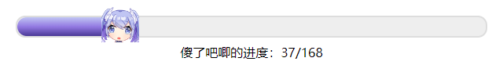

# progress-bar

这是一个显示任务进度的进度条，使用Vue3编写，使用效果如下

## 使用说明

使用`<ProgressBar/>`直接引入

组件需要三个必要参数和一个可选参数

| 参数名 |             类型             |    作用    | 必选 |
| :----: | :--------------------------: | :--------: | :--: |
| title  |             标题             |    标题    |  ✓   |
| total  |             数字             |   总进度   |  ✓   |
| recent |             数字             |  当前进度  |  ✓   |
| colors | 颜色十六进制编码的字符串数组 | 进度条颜色 |  ×   |

可选参数`colors`一般配合插槽使用

该组件只有一个默认插槽，插槽默认为向晚的头，传入内容时，插槽中的内容将会替代向晚的头用以标识当前进度
